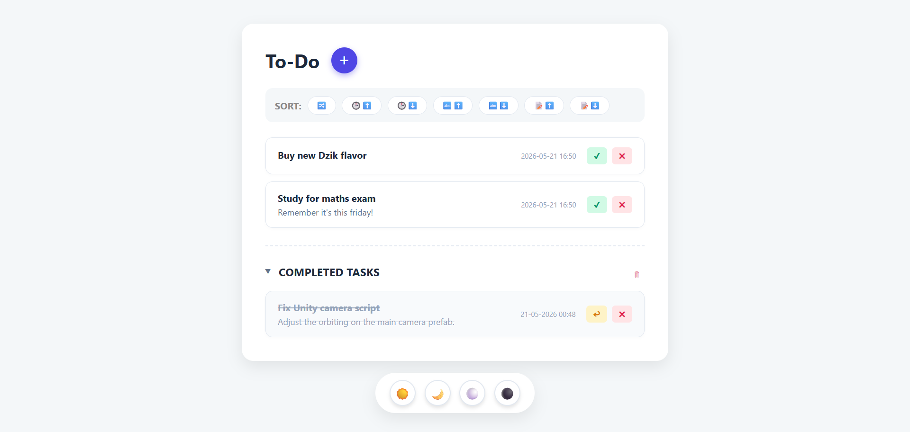

# Web app description:

To-Do is a simple web app running Python with Flask framework used to, well, create and manage a To-Do list! Add, archive, remove, reorder and sort your upcoming tasks quickly and easily. It runs on localhost. The database is SQLite and saves in a .db file, so it can be run offline and saves between sessions.

# User interface:

# Running the project:

.\venv\Scripts\Activate.ps1; python app.py
